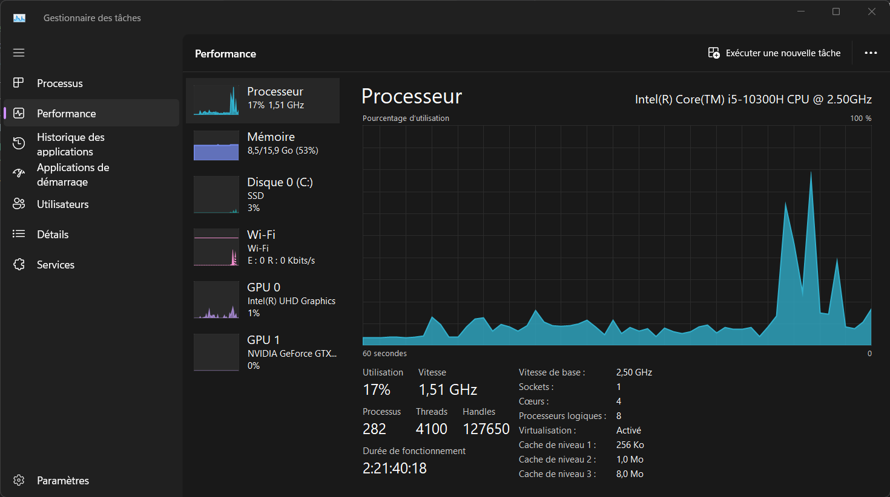
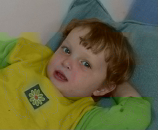

Remarque : étant donné que j'ai passé beaucoup de temps à débuger la première méthode, je ne pense pas avoir suffisamment de temps pour effectuer la seconde méthode, je vais donc m'appliquer à rédiger un compte rendu détaillé pour la première méthode et abandonné l'implémentation de la seconde méthode.

## Configuration : 

- 4 Coeurs de calcul
- Cache de niveau 1 : 256 Ko
- Cache de niveau 2 : 1.0 Mo
- Cache de niveau 3 : 8.0 Mo

<div style="text-align:center;">
  
</div>

## Stratégie de parallélisation

L'idée de la première méthode est de découper l'image de gris en nbp(4) sous-images locales au différents processus, j'ai décidé de découpé l'image en 4 tranches de plusieurs lignes.
```
values_gray = np.array(im_gray)
num_rows = values_gray.shape[0]
starting_index = rank * num_rows // nbp
ending_index = (rank+1) * num_rows // nbp if rank < nbp -1 else (rank+1) * num_rows // nbp + num_rows % nbp
values_gray_loc = values_gray[starting_index:ending_index,:]
```

Puis pour chacune de ces sous images on va résoudre le problème localement. Pour cela à partir de `values_gray_loc` on va calqué sur le programme initial pour avoir toutes les variables locales utiles au calcul: `intensity_loc`,`means_loc`,`variance_loc`,`A_loc`. Puis on va également chargé l'image marquée et la découper de la même manière : 
```
im = Image.open(marked_img)
im_ycbcr = im.convert('YCbCr')
val_ycbcr = np.array(im_ycbcr)
val_ycbcr_loc = val_ycbcr[starting_index:ending_index,:]
```
et on en déduit les dernières variables nécessaires au problème de minimisation sur les différent processus : `Cb_loc`,`Cr_loc`,`b_Cb_loc`,`b_Cr_loc`,`val_hsv_loc`,`fix_coul_indices_loc`, puis on applique la condition de dirichelet `apply_dirichlet(A_loc, fix_coul_indices_loc)`.

On peut enfin résoudre leS problèmes de minimisation sur chaque processus : 
```
x0_loc = np.zeros(Cb_loc.shape,dtype=np.double)
new_Cb_loc = Cb_loc + minimize(A_loc, b_Cb_loc, x0_loc, niters,epsilon)

x0_loc = np.zeros(Cr_loc.shape,dtype=np.double)
new_Cr_loc = Cr_loc + minimize(A_loc, b_Cr_loc, x0_loc, niters,epsilon)
```

La minimisation étant faite, tous les processus envoie leurs résultats au processus 0 : 
```
if rank != 0:
    comm.send([new_Cb_loc,new_Cr_loc,intensity_loc], dest=0)
```

 il reste l'étape la plus délicate : rassembler les résultats de tous les processus, pour cela il fallait être très méticuleux sur les dimensions des différents éléments, en particulier, les variables `new_Cb_loc` et `new_Cr_loc` qui étaient des tableaux en une dimension qu'il fallait redimensionner avec les bonnes tailles d'images locales. Pour l'intensité, il fallait également faire attention aux indices dans le slicing, en effet, pour calculer les moyennes et variances sur chaques processus, on a rajouté des lignes et colones sur les bords. Après une certaine quantité de débogage en regardant les shapes des différentes variables, j'ai aboutit à l'assemblage suivant : 

```
if rank == 0:
    new_Cb = np.zeros((values_gray.shape[0],values_gray.shape[1]))
    new_Cr = np.zeros((values_gray.shape[0],values_gray.shape[1]))
    intensity = np.zeros((values_gray.shape[0], values_gray.shape[1]))

    new_Cb[starting_index:ending_index,:] = np.reshape(new_Cb_loc,(ending_index-starting_index, values_gray.shape[1]))
    new_Cr[starting_index:ending_index,:] = np.reshape(new_Cr_loc,(ending_index-starting_index, values_gray.shape[1]))
    intensity[starting_index:ending_index,:] = intensity_loc[2:-2,2:-2]

    for i in range(1,nbp):
        starting_index = i * num_rows // nbp
        ending_index = (i+1) * num_rows // nbp if i < nbp-1 else (i+1) * num_rows // nbp + num_rows % nbp - 1

        [new_Cb_ext,new_Cr_ext,intensity_ext] = comm.recv(source=i)

        # print(i,"new_Cb_ext",new_Cb_ext.shape, "dim de reshape:", (ending_index-starting_index, values_gray.shape[1]))

        new_Cb[starting_index:ending_index,:] = np.reshape(new_Cb_ext,(ending_index-starting_index, values_gray.shape[1]))
        new_Cr[starting_index:ending_index,:] = np.reshape(new_Cr_ext,(ending_index-starting_index, values_gray.shape[1]))

        intensity[starting_index:ending_index,:] = intensity_ext[2:-2,2:-2]
```

Remarque, on aurait également pu utiliser Gatherv pour envoyer tous les résultats sur le processus 0 de façon plus rapide, mais j'ai préféré utilisé send et recv par soucis de simplicité et lisibilité.

Pour un nombre d'itération `niters = 3000` on obtient le résultat suivant :

<div style="text-align:center;">
  
</div>

